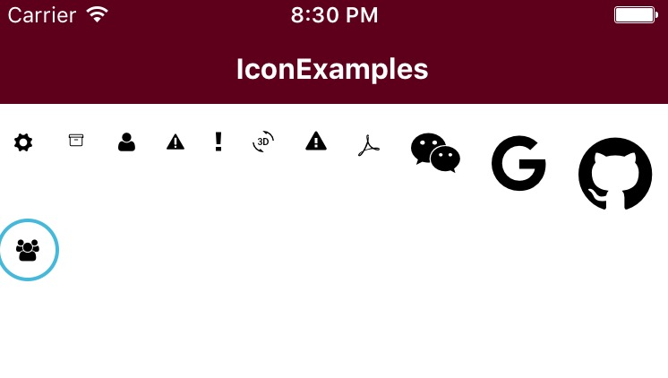

#Icon
the icon use [react-native-vector-icons](https://github.com/oblador/react-native-vector-icons)

## Use

    <Icon name="cog"
          provider="Entypo"
    />
    <Icon name="archive"
          provider="EvilIcons"
    />
    <Icon name="user"/>

    <Icon name="alert"
          provider="Foundation"
    />
    <Icon name="alert"
          provider="Ionicons"
    />
    <Icon name="3d-rotation"
          provider="MaterialIcons"
    />
    <Icon name="alert"
          provider="Octicons"
    />
    <Icon name="acrobat"
          provider="Zocial"
    />
    <Icon name="weixin"
          size={24}
    />
    <Icon name="google"
          size={36}
    />
    <Icon name="github"
          size={48}
    />