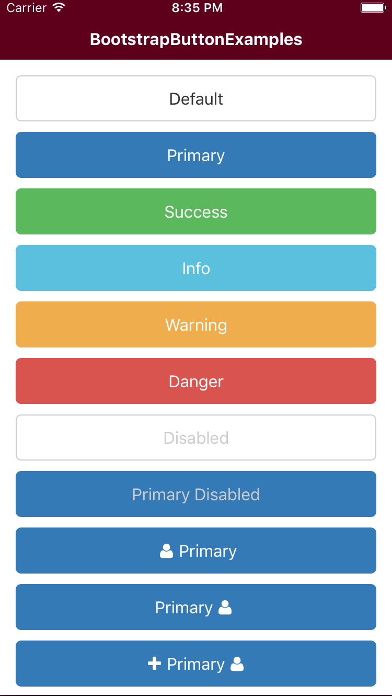

# Bootstrap Button
Bootstrap Button for React Native Component.

## Examples

[Bootstrap Button](../Examples/src/components/BootstrapButtonExamples.js)

## Use

    <Button 
    	afterIcon="user"
    	beforeIcon="plus"
    	bsStyle="primary"
    	style={{marginBottom: 10}}>
    	Primary Button
    </Button>
    
    <Button 
    	afterIcon="user"
    	beforeIcon="plus"
    	bsStyle="primary"
    	style={{marginBottom: 10}}>
    	<View>
    		<Text>Custom Content</Text>
    	</View>
    </Button>

## Properties
[TouchableOpacity props...](http://facebook.github.io/react-native/docs/touchableopacity.html#props)

| Name           | Type     | Default  | Description   |
|----------------|----------|----------|---------------|
| disabled | Boolean | false | disabled button |
| afterIcon | String | undefined | text after icon |
| beforeIcon | String | undefined | text before icon |
| bsStyle | Enum: ['primary', 'success', 'info', 'warning', 'danger', 'link', 'default'] | default | bootstrap style |
| color | String | undefined | font and icon color |
| fontSize | Number | 16 | font and icon size |
| iconProps | Object | {} | icon props |
| style | Object | {} |Override the inline-styles of the root element. |
