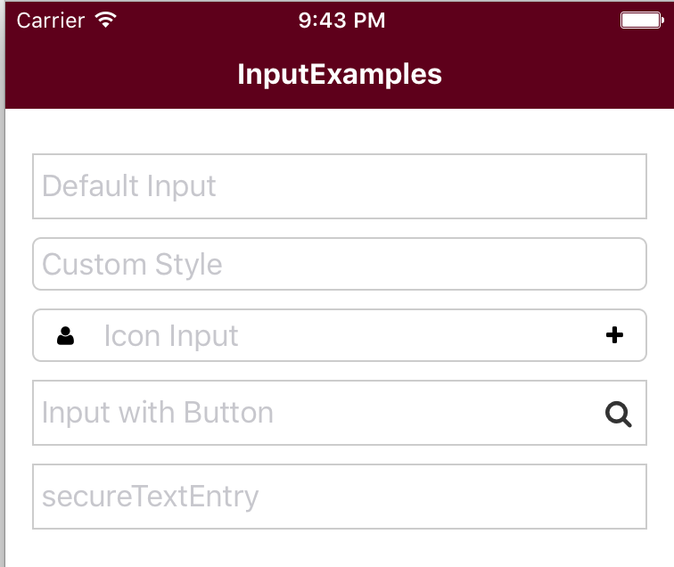

# Input
React Native Input Component

## Examples
[Input Examples](../Examples/src/components/InputExamples.js)

## Use

    <Input />
    <Input placeholder="First Name" />

    # Icon Input
    <Input before="email"
           placeholder="Email"
    />

    # Custom Input
    let btn = (
        <Button beforeIcon="search"
                bsStyle="link"
                style={{justifyContent: 'center', alignItems: 'center', width: 30}}
        />
    );
    <Input placeholder="Input with Button"
           after={btn}
    />

## Properties
| Name           | Type     | Default  | Description   |
|----------------|----------|----------|---------------|
| after | String,Element | undefined | if after is String,the will use Icon Component |
| before | String,Element | undefined | if before is String, the will use Icon Component |
| customValid | Function | undefined | custom value validation method |
| iconProps | Object | {} | icon props |
| iconStyle | Object | undefined | icon style |
| inputStyle | Object | undefined | input style |
| name | String | undefined | form use |
| pattern | RegExp | undefined | input value pattern |
| required | Boolean | false | input value is required |

## Method
| Name           | Arguments| return | Description |
|----------------|----------|--------|----------|
| getValue |  | String | get input value |
| valid |  | Boolean | if true ,input value is valid |